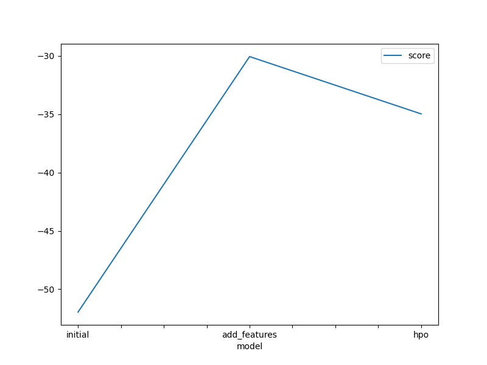
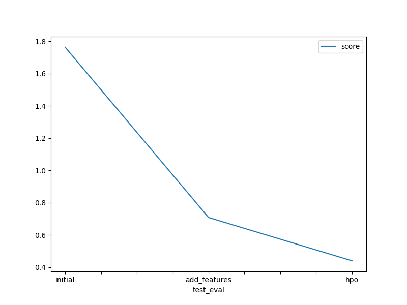

# Report: Predict Bike Sharing Demand with AutoGluon Solution
#### Beatriz Farias do Nascimento

## Initial Training
### What did you realize when you tried to submit your predictions? What changes were needed to the output of the predictor to submit your results?
When I tried to submit my predictions, I realized that Kaggle has some restrictions on them. As stated in the notebook, I had to make sure that every value is equal or greater than zero. I used the function np.clip(predictions, 0, None) from numpy to assure that.

### What was the top ranked model that performed?
The model 'WeightedEnsemble_L3' that used the hyperparameters configuration was the one that scored higher. This same model scored the best among the other models in the initial predictor and the predictor with new features.

## Exploratory data analysis and feature creation
### What did the exploratory analysis find and how did you add additional features?
The Exploratory data analysis helped me to understand the data better and find patterns. With it, I identified some features there were categorical and changed their type, and selected some time frames with higher "count",to a new feature named "rush_hour". This feature addition was made by extracting the hour from the datetime feature, creating a "hour" feature and selecting three time frames as "rush hour time frames". When the hour feature is within the "rush hour time frames", the "rush_hour" has the value 1, and it has the value 0, otherwise.

### How much better did your model preform after adding additional features and why do you think that is?
My model scored significantly better after adding a feature. In my notebook, I added the hour and rush_hour features my kaggle score was more than 1.0 lower: from 1.76244 to 0.70749 and the model score went from -51.960611 to -30.061008. I believe that happened because of the addition of the "rush_hour" feature, that highly relates to a higher "count", improving the training.

## Hyper parameter tuning
### How much better did your model preform after trying different hyper parameters?
The model performed much better after including the hyperparameters feature, the difference in the kaggle score was significant, from 0.70749 after adding the features to 0.4396 with the hyperparameters, but the model score went from -30.061008 after adding the features to -34.973949, decreasing slightly.

### If you were given more time with this dataset, where do you think you would spend more time?
I would spend more time selecting different features to add in the new_predictor and researching about the hyperparameters to get a better score in the new_predictor and predictor_new_hpo.
### Create a table with the models you ran, the hyperparameters modified, and the kaggle score.
The best model for the three different predictors was 'WeightedEnsemble_L3'
|predictor|best model|hpo1|hpo2|hpo3|score|
|--|--|--|--|--|--|
|initial|WeightedEnsemble_L3|default|default|default|1.80353|
|add_features|WeightedEnsemble_L3|default|default|default|1.78521|
|hpo|WeightedEnsemble_L3|XGBoost|KNN|NN_TORCH|1.29706|

### Create a line plot showing the top model score for the three (or more) training runs during the project.

TODO: Replace the image below with your own.

### Create a line plot showing the top kaggle score for the three (or more) prediction submissions during the project.

TODO: Replace the image below with your own.

## Summary
Overall, as the new features and hyperparameters were added to the model, the performance improved. 
